# XEEPL ERP

> ERP to manage Users, Sections, Contents, Items, Raw Materials, Catalogs and Quotations. Built with React (Vite) and Spring Boot. Quotation web view and PDF stay visually in sync, including nested raw materials and “removed raws” display.

[](#license)

---

## 📘 Table of Contents

- [Overview](#overview)
- [Highlights](#highlights)
- [Screenshots](#screenshots)
- [Architecture](#architecture)
- [Prerequisites](#prerequisites)
- [Quick Start](#quick-start)
- [Backend Setup](#backend-setup)
- [Frontend Setup](#frontend-setup)
- [Quotation Module (step‑by‑step)](#quotation-module-step-by-step)
- [API Reference (key endpoints)](#api-reference-key-endpoints)
- [PDF Generation](#pdf-generation)
- [Troubleshooting & FAQ](#troubleshooting--faq)
- [License & Contact](#license--contact)

---

## 🧾 Overview
XEEPL ERP is a compact, production‑oriented ERP. The Quotation module supports hierarchical lines:
- Item rows (1, 2, 3 …) with bold title and optional description
- Raw material rows nested under the parent item (a, b, c …)
- Toggle to show/hide raw prices
- Show removed raws inline under their parent (with strikethrough) across all statuses

The PDF export mirrors exactly what you see on the web view, keeping the final customer output consistent.

---

## ✨ Highlights
- React 19 + Vite for a fast UI
- Spring Boot + JPA for clean backend APIs
- Proper REST endpoints for editing lines, removing/undoing raw materials
- “Assign Customer” flows are persisted to the backend
- Manage Linked Catalogs with ZIP download
- Web view and PDF output stay in sync

---

## 🖼️ Screenshots

Make Quotation (Draft view)

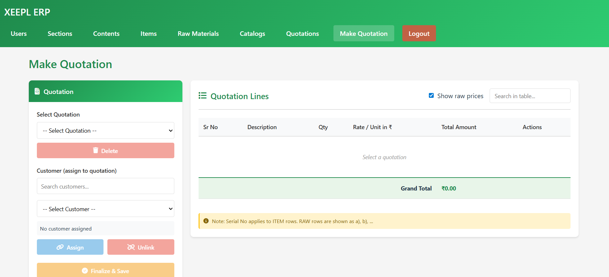

View Quotation table (Finalized view with nested raws)

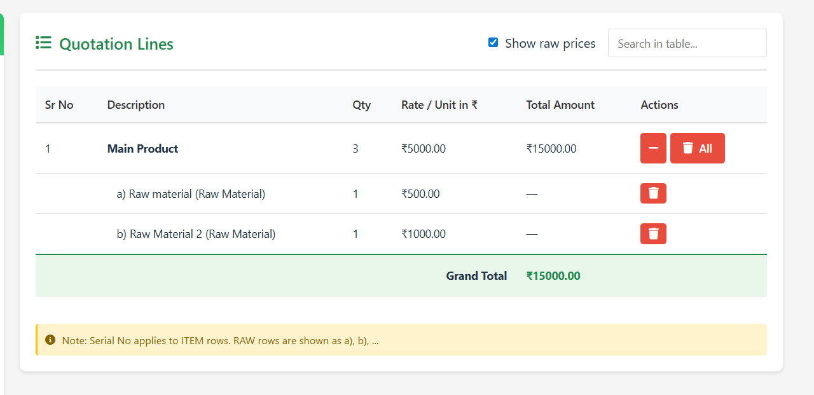

Show Removed RAWs (toggle on, removed raws inline under their parent)

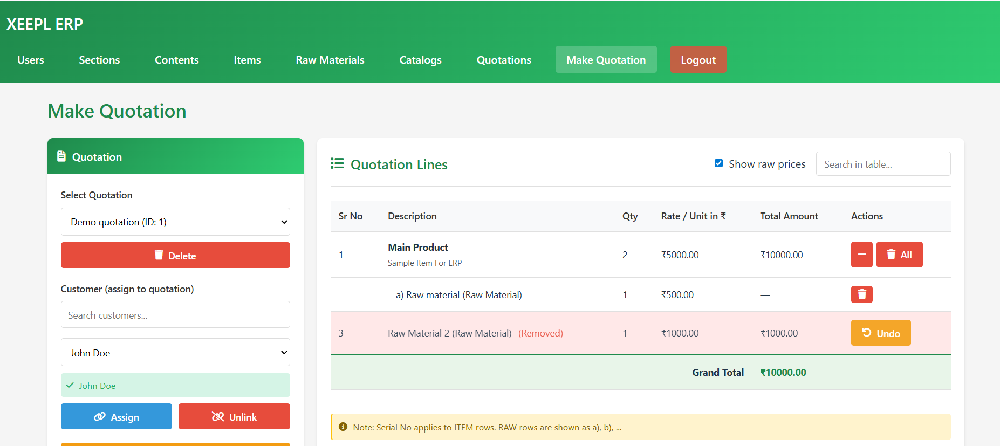

Quotation PDF (matches web view)

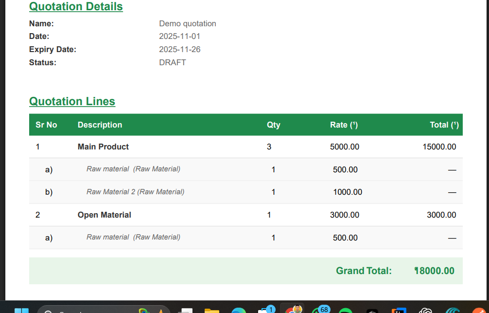

Masters and Catalogs

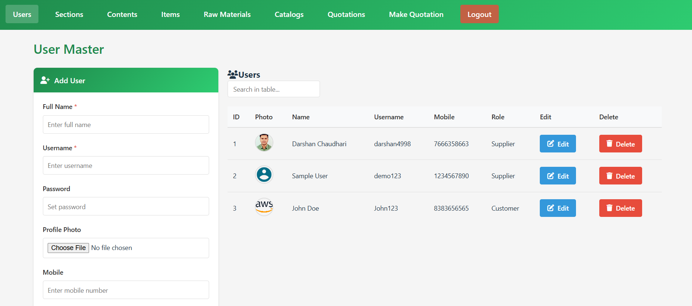
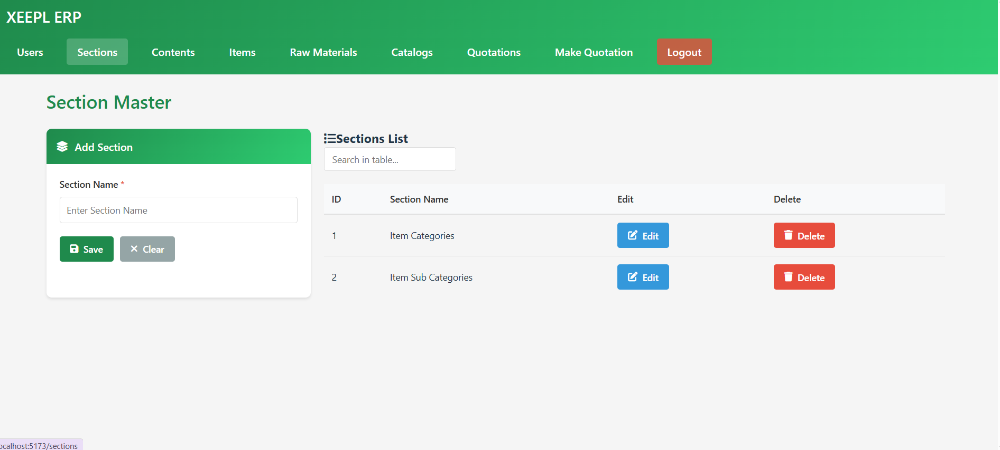
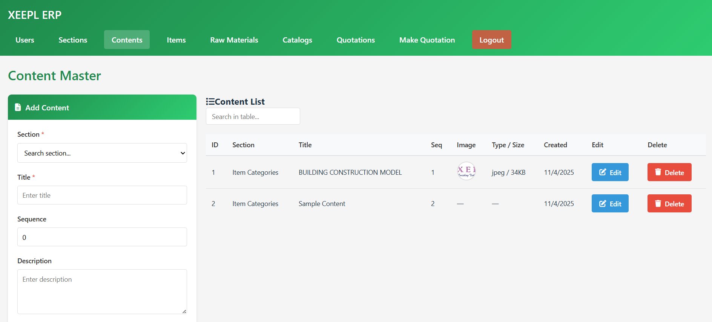
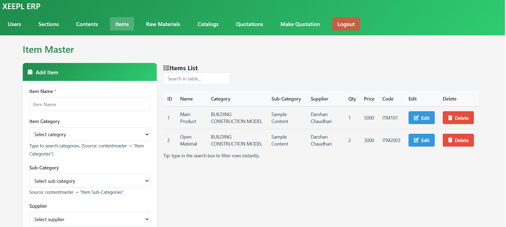
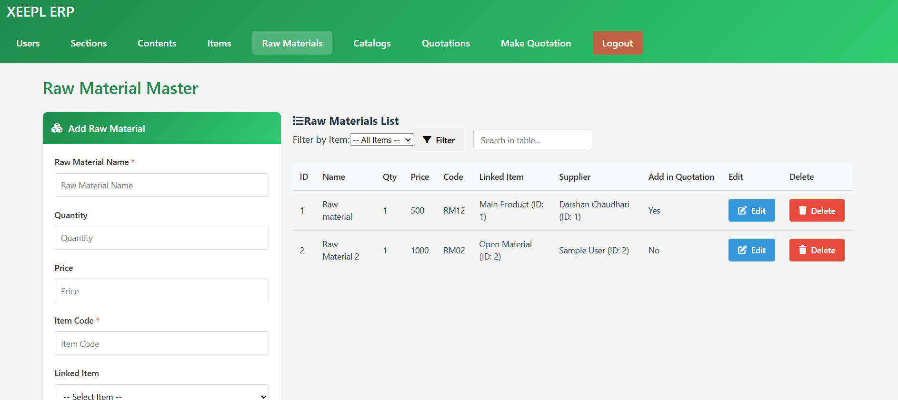
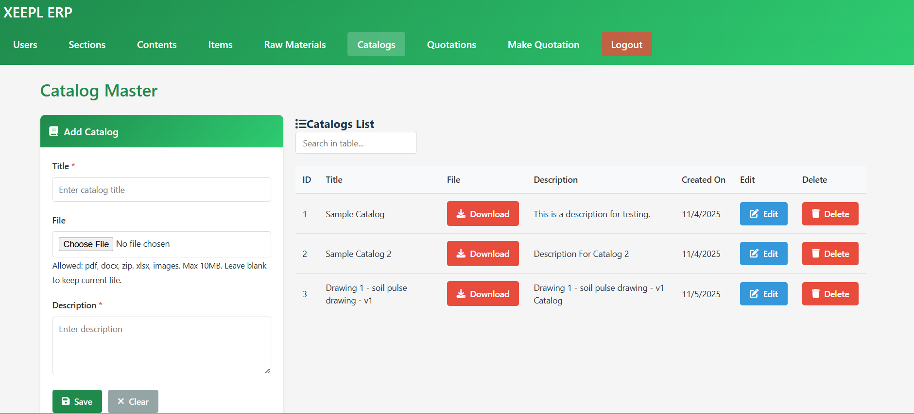
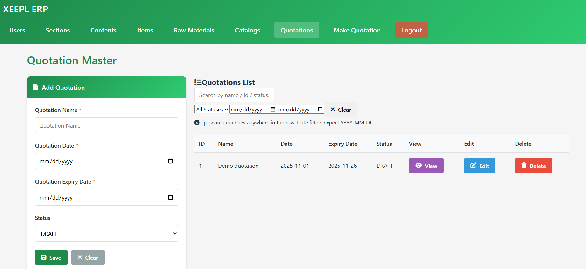

---

## 🏗️ Architecture

Browser (React @5173) ← REST → Spring Boot API @8080 ← JDBC → MySQL  
+ File system (uploads/) for catalogs  
+ Client‑side PDF rendering to match the UI exactly

### Diagrams

System architecture

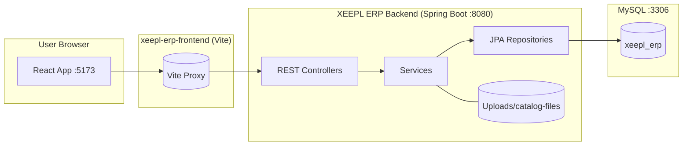

Quotation module flow

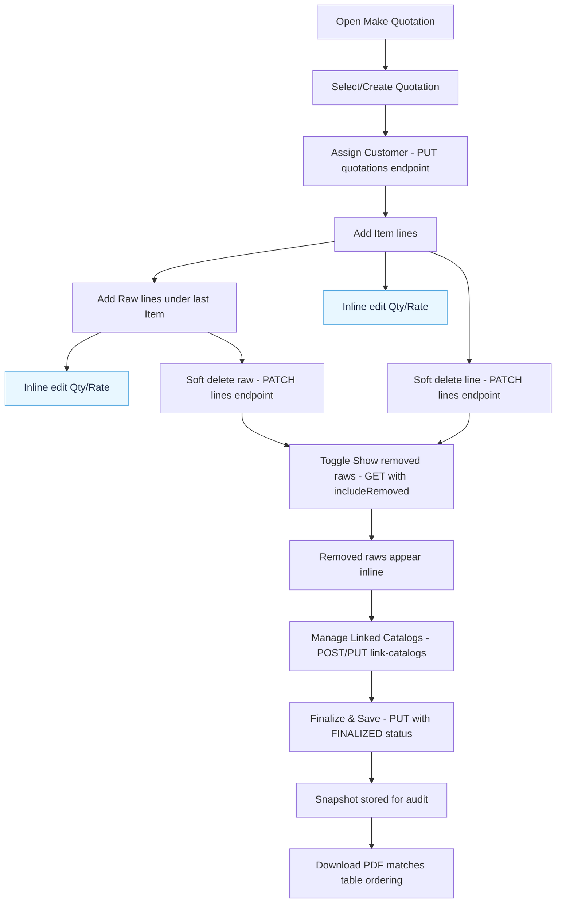

End-to-end sequence

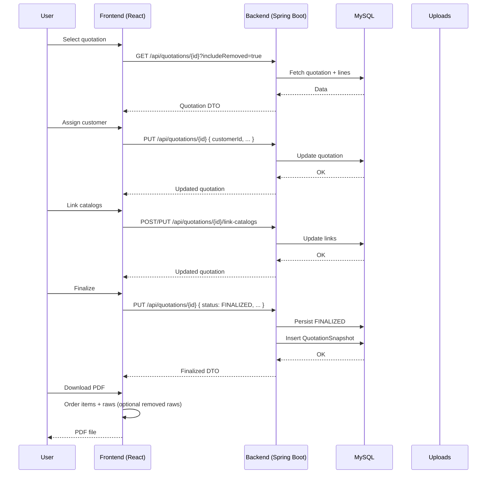

---

## ⚙️ Prerequisites
- Node.js 18+
- Java 17+
- Maven 3.8+
- MySQL 8+

Ports: Frontend 5173, Backend 8080, DB 3306

---

## 🚀 Quick Start
```bash
# 1) Start backend
cd "XEEPL ERP Backend"
./mvnw spring-boot:run

# 2) Start frontend
cd ../xeepl-erp-frontend
npm install
npm run dev

# Open the app
# http://localhost:5173
```

---

## 🔧 Backend Setup
Configure `src/main/resources/application.properties`:
```
server.port=8080
spring.datasource.url=jdbc:mysql://localhost:3306/xeepl_erp?useSSL=false&serverTimezone=UTC
spring.datasource.username=xe_user
spring.datasource.password=xe_password
spring.jpa.hibernate.ddl-auto=update
spring.jpa.show-sql=true
spring.jpa.properties.hibernate.format_sql=true
spring.jpa.properties.hibernate.dialect=org.hibernate.dialect.MySQL8Dialect
spring.datasource.hikari.maximum-pool-size=10
spring.datasource.hikari.minimum-idle=5
spring.datasource.hikari.leak-detection-threshold=60000
app.file.upload-dir=D:/XEEPL ERP/XEEPL ERP Backend/uploads/catalog-files
spring.servlet.multipart.max-file-size=10MB
spring.servlet.multipart.max-request-size=20MB
```
Run:
```bash
./mvnw clean package
./mvnw spring-boot:run
# OR
java -jar target/xeepl-erp-backend-0.0.1-SNAPSHOT.jar
```

---

## 💻 Frontend Setup
Create `.env.local` in `xeepl-erp-frontend` if you don’t use the dev proxy:
```
VITE_API_BASE=http://localhost:8080
```
Vite dev proxy (already configured) forwards `/api` to `:8080`.
```bash
cd xeepl-erp-frontend
npm install
npm run dev
```

---

## 📑 Quotation Module (step‑by‑step)
1) Create or select a quotation (left sidebar)  
2) Assign Customer: choose a customer and click Assign to persist  
3) Add lines: add Items first, then add Raw materials which attach under the last item  
4) Inline edit: Edit quantity and rate in place for items/raws in both Draft and Finalized views  
5) Remove/Undo raws: removed raws stay linked to their parent; toggle “Show removed raws” to display inline  
6) Manage Linked Catalogs: open modal, select catalogs, Save & Assign, optional download ZIP  
7) Finalize & Save: persists quotation with status FINALIZED and creates a snapshot for audit  
8) Download PDF: output mirrors the web table layout and ordering

---

## 🌐 API Reference (key endpoints)
Base URL: `/api`

- Quotations
  - GET `/quotations` – list
  - GET `/quotations/{id}` – fetch (query `includeRemoved=true` to include removed raws)
  - POST `/quotations` – create
  - PUT `/quotations/{id}` – update/finalize
  - DELETE `/quotations/{id}` – delete
  - PATCH `/quotations/lines/{lineId}` – edit line (qty, price, desc)
  - PATCH `/quotations/lines/{lineId}/remove` – soft delete line
  - PATCH `/quotations/lines/{lineId}/undo` – restore removed line
  - POST/PUT `/quotations/{id}/link-catalogs` – link catalogs
  - GET `/quotations/{id}/catalogs-zip` – download linked catalogs (ZIP)
  - GET `/quotations/{id}/export-pdf` – export pdf (stub or client‑side download)

Other modules have standard CRUD endpoints, e.g. `/users`, `/items`, `/raw-materials`, `/catalogs`.

---

## 🧠 PDF Generation
- Client-side PDF leverages the same data ordering as the table:
  - Items rendered as 1..N with totals
  - Child raw rows as a), b), … under each item
  - Optional inclusion of removed raws if the toggle is on at download time

---

## ⚠️ Troubleshooting & FAQ
- 404/500 on catalog download: verify files exist in `uploads/` and controller mapping
- CORS in dev: use the existing Vite proxy or enable CORS on backend
- DB connection: ensure credentials and port, adjust Hikari settings for your environment

---

## 📄 License & Contact
License: MIT  
Contact: support@xeepl.com

---

### Appendix: Quick Setup
```bash
# Clone
git clone https://github.com/youruser/XEEPL_ERP.git
cd XEEPL_ERP

# Backend
cd "XEEPL ERP Backend"
./mvnw spring-boot:run

# Frontend
cd ../xeepl-erp-frontend
npm install
npm run dev

# Open
# http://localhost:5173
```