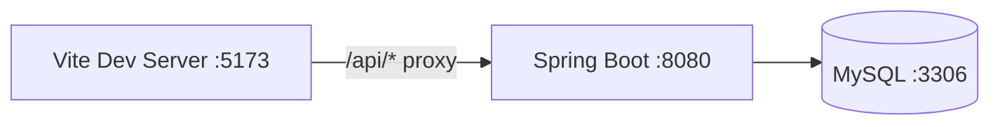

# XEEPL ERP Frontend

React + Vite frontend for the XEEPL ERP. It provides master screens and a rich Quotation module with nested raw materials, inline editing, and PDF export that matches the web view.

## 🔧 Prerequisites
- Node.js 18+
- Backend API at `http://localhost:8080` (or use the dev proxy)

## 🚀 Run
```bash
npm install
npm run dev
# http://localhost:5173
```

Dev proxy (see `vite.config.js`) forwards `/api` to the backend to avoid CORS issues.

## 🗂️ Structure
```
src/
├── components/
│   ├── common/
│   ├── users/
│   ├── sections/
│   ├── contents/
│   ├── items/
│   ├── rawmaterials/
│   ├── catalogs/
│   └── quotations/      # MakeQuotation, QuotationView, QuotationMaster
├── services/            # API layer (quotationService, api.js with GET/POST/PUT/PATCH/DELETE)
├── styles/
├── utils/               # pdfGenerator, constants
├── App.jsx
└── main.jsx
```

## ✨ Quotation module (how to use)
1) Go to Make Quotation. Select an existing quotation or create one.
2) Assign Customer: pick a customer and click Assign (persists to backend).
3) Add lines:
   - Add Item (main row).  
   - Add Raw — attaches under the most recent Item as a), b), …
4) Edit inline: click Edit on an Item/Raw to change Qty/Rate; Save/Cancel.
5) Remove/Undo raws: remove a raw; toggle “Show removed raws” to reveal it inline under its parent; click Undo to restore.
6) Manage Linked Catalogs: open modal, select catalogs, Save & Assign; optionally download ZIP from the view page.
7) Finalize & Save: sets status FINALIZED and snapshots the quotation.
8) Download PDF: mirrors the current table layout (items then raws).

## 📊 Diagrams

Frontend/Proxy/Backend dev setup



Frontend quotation components map

```mermaid
flowchart TD
  App --> QuotationMaster[components/quotations/QuotationMaster]
  App --> MakeQuotation[components/quotations/MakeQuotation]
  App --> QuotationView[components/quotations/QuotationView]

  MakeQuotation --> S1[services/quotationService]
  MakeQuotation --> S2[services/userService]
  MakeQuotation --> S3[services/itemService]
  MakeQuotation --> S4[services/rawMaterialService]
  MakeQuotation --> S5[services/catalogService]
  MakeQuotation --> Utils[utils/pdfGenerator.jsx]

  QuotationView --> S1
  QuotationView --> Utils

  S1 -.-> api[services/api.js (GET/POST/PUT/PATCH/DELETE)]
```

Quotation UI flow (draft to finalized)

```mermaid
flowchart TD
  A[Open Make Quotation] --> B[Select/Create Quotation]
  B --> C["Assign Customer - PUT /quotations/{id}"]
  C --> D[Add Item lines]
  D --> E[Add Raw lines under last Item]
  D --> D1[Inline edit Qty/Rate]
  E --> E1[Inline edit Qty/Rate]
  D --> D2["Soft delete line - PATCH /lines/{id}/remove"]
  E --> E2["Soft delete raw - PATCH /lines/{id}/remove"]
  D2 --> F["Toggle Show removed raws - GET /quotations/{id}?includeRemoved=true"]
  E2 --> F
  F --> G[Removed raws appear inline (a, b, ...)]
  G --> H["Manage Linked Catalogs - POST/PUT /quotations/{id}/link-catalogs"]
  H --> I["Finalize & Save - PUT /quotations/{id} (FINALIZED)"]
  I --> J[Snapshot stored (audit)]
  J --> K[Download PDF (matches table ordering)]
```

## 🧪 Commands
- `npm run dev` – start dev server
- `npm run build` – production build
- `npm run preview` – preview production build
- `npm run lint` – run ESLint

## 📸 Screens
The main repository root README includes annotated screenshots:
- Make Quotation (draft)
- View Quotation (finalized)
- Show Removed Raws
- Quotation PDF
- Masters (User, Section, Content, Item, Raw, Catalog)

## 📄 License
MIT (see project root). © 2025 XEEPL ERP.
